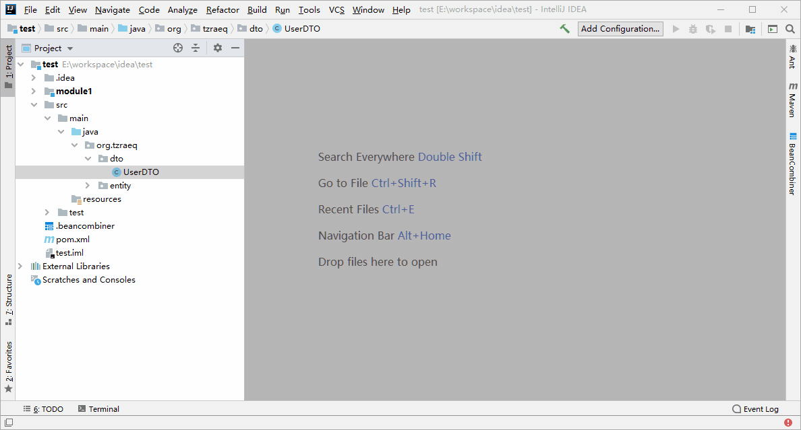

## 概述
### 这是一个IDEA插件，可以很方便地将其他bean的字段合并到当前bean。

## 感谢
- CheckTreeTable的作者，以及相关的几位外国友人

## 细节
- 插件的设计场景，是针对beans to bean 
- 选定的来源类字段，是根据get或is方法进行解析，目前的规则比较简单
- 目前功能比较简单，但不限制使用场景，只要是java类，都可以进行类似的操作
- UI是我临时找了一个CheckTreeTable，所以我改得不太好

## 版本
### 此处是设计版本，发布版本请去Jetbrains的插件页面查看
- V1.0
    - 可以通过右侧`tool window`进行属性选取
    - 选取后合并的配置，都会保存在类所在的模块根目录，文件名是`.beancombiner`，是yaml格式，